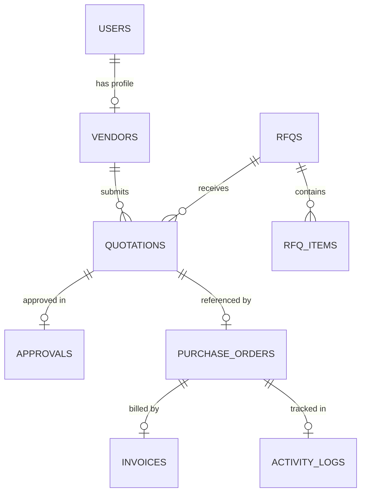

# VendorBridge ERP

<a id="top"></a>


> **Enterprise-Grade B2B Procurement Lifecycle Management System**
>
> VendorBridge is a full-stack ERP system designed to streamline procurement workflows with complete lifecycle tracking, GST compliance, and real-time analytics.

---

## 📋 Table of Contents

- [Overview](#-overview)
- [Key Features](#-key-features)
- [Tech Stack](#-tech-stack)
- [Quick Start](#-quick-start)
- [Project Structure](#-project-structure)
- [Documentation](#-documentation)
- [Development](#-development)
- [Support](#-support--troubleshooting)

---

## 🎯 Overview

VendorBridge is a complete procurement management solution connecting:
- **Officers**: Create RFQs, manage vendors, authorize approvals
- **Managers**: Review and approve procurement requests
- **Vendors**: Submit quotations, deliver goods, invoice payments

The system automates the entire procurement pipeline from RFQ creation through invoice settlement with full audit trails and compliance checks.

**Key Statistics:**
- Support for unlimited vendors and procurement items
- Real-time activity auditing with CSV export
- Interactive analytics dashboards
- GST-compliant tax calculations
- Print-first PDF generation

---

## ✨ Key Features

### Core Procurement
- **RFQ Management**: Draft, publish, and track requests for quotations
- **Quotation Portal**: Vendor bidding with automated best-price comparison
- **Approval Workflow**: Multi-level approval gates with audit trails
- **Purchase Orders**: Auto-generated from approved quotations with sequential numbering
- **Invoice Management**: Vendor billing with payment settlement tracking

### Compliance & Reporting
- **Indian GST Compliance**: Auto-detects CGST+SGST (intra-state) vs IGST (inter-state)
- **Audit Logs**: Complete activity history with search, filter, and CSV export
- **Tax Processor**: Intelligent tax calculation based on GSTIN prefix
- **Vendor Rating**: Performance tracking based on PO history

### User Experience
- **Interactive Dashboards**: Spend trends, category analysis, supplier rankings
- **Role-Based Access**: Officer, Manager, Vendor, Admin profiles
- **Real-Time Notifications**: Status updates and approval alerts
- **Print-Optimized Templates**: Direct PDF export without external services

---

## 🛠 Tech Stack

| Layer | Technology |
|-------|-----------|
| **Frontend** | React 19, TypeScript, Vite, TailwindCSS |
| **State Management** | Zustand |
| **Charts & Analytics** | Recharts |
| **Backend** | Express.js, TypeScript |
| **Database** | MySQL 8.0+ |
| **Authentication** | JWT |
| **Validation** | Zod |
| **Logging** | Winston |
| **Security** | Helmet, bcryptjs |

---

## 🚀 Quick Start

### Prerequisites
- **Node.js** 18+ and **npm** 9+
- **MySQL** 8.0+
- **Git**

### Installation

```bash
# 1. Clone repository
git clone https://github.com/YashvardhanJani/VendorBridge
cd VendorBridge

# 2. Setup Database
mysql -u root -p < database/schema.sql
mysql -u root -p < database/seed.sql

# 3. Backend Setup
cd server
npm install
cp .env.example .env  # Configure environment variables
npm run dev

# 4. Frontend Setup (new terminal)
cd ../client
npm install
npm run dev
```

**Server runs on:** `http://localhost:5000`  
**Client runs on:** `http://localhost:5173`

### Default Test Credentials

| Role | Email | Password |
|------|-------|----------|
| Officer | officer@vendorbridge.com | test123 |
| Manager | manager@vendorbridge.com | test123 |
| Vendor | vendor@vendorbridge.com | test123 |
| Admin | admin@vendorbridge.com | test123 |

---

## 📁 Project Structure

```
VendorBridge/
├── docs/                          # 📚 Complete documentation
│   ├── README.md                  # Quick docs reference
│   ├── ARCHITECTURE.md            # System design & folder structure
│   ├── API_CONTRACT.md            # API endpoints (frozen)
│   ├── DATABASE_SCHEMA.md         # DB schema (frozen)
│   ├── STATUS_FLOWS.md            # Business process flows
│   ├── SETUP_GUIDE.md             # Detailed setup & config
│   └── CONTRIBUTING.md            # Developer guidelines
├── server/                        # 🔧 Backend API
│   ├── src/
│   │   ├── server.ts              # Express app entry
│   │   ├── dbSetup.ts             # Database initialization
│   │   ├── config/                # Configuration files
│   │   ├── models/                # Sequelize models
│   │   ├── controllers/           # Business logic
│   │   ├── routes/                # API routes
│   │   ├── middleware/            # Auth & validation
│   │   ├── validators/            # Zod schemas
│   │   └── utils/                 # Helper functions
│   ├── logs/                      # Winston logs (runtime)
│   ├── package.json
│   └── tsconfig.json
├── client/                        # 💻 Frontend React App
│   ├── src/
│   │   ├── main.tsx               # React entry point
│   │   ├── App.tsx                # Root component
│   │   ├── pages/                 # Route components
│   │   │   ├── auth/              # Login, Signup
│   │   │   ├── dashboard/         # Analytics
│   │   │   ├── rfqs/              # RFQ management
│   │   │   ├── approvals/         # Approval workflow
│   │   │   ├── purchase-orders/   # PO management
│   │   │   ├── invoices/          # Billing
│   │   │   ├── vendors/           # Vendor profiles
│   │   │   ├── notifications/     # Alerts
│   │   │   ├── logs/              # Audit trails
│   │   │   └── reports/           # Analytics
│   │   ├── components/            # Reusable UI components
│   │   ├── services/              # API client
│   │   ├── store/                 # Zustand stores
│   │   ├── hooks/                 # Custom hooks
│   │   └── utils/                 # Helpers & constants
│   ├── public/
│   ├── package.json
│   └── vite.config.ts
├── database/                      # 📊 Database files
│   ├── schema.sql                 # Table definitions
│   └── seed.sql                   # Initial data
└── README.md                      # Project README
```

---

## 📚 Documentation

All documentation is organized in the `docs/` folder:

| Document | Purpose |
|----------|---------|
| **[ARCHITECTURE.md](./docs/ARCHITECTURE.md)** | System design, folder structure, module responsibilities |
| **[API_CONTRACT.md](./docs/API_CONTRACT.md)** | API endpoints, request/response formats (frozen) |
| **[DATABASE_SCHEMA.md](./docs/DATABASE_SCHEMA.md)** | Database tables, fields, relationships (frozen) |
| **[STATUS_FLOWS.md](./docs/STATUS_FLOWS.md)** | Business process state machines and transitions |
| **[SETUP_GUIDE.md](./docs/SETUP_GUIDE.md)** | Installation, configuration, environment setup |
| **[CONTRIBUTING.md](./docs/CONTRIBUTING.md)** | Code standards, commit conventions, PR process |

---

## 💻 Development

### Available Commands

**Backend:**
```bash
cd server

npm run dev        # Start dev server with hot reload
npm run build      # Compile TypeScript to JavaScript
npm start          # Run compiled server (production)
npm run seed       # Initialize database with seed data
npm run db:setup   # Alternative to seed
```

**Frontend:**
```bash
cd client

npm run dev        # Start Vite dev server
npm run build      # Production build
npm run lint       # Run ESLint
npm run preview    # Preview production build locally
```

### Environment Configuration

**Backend (.env):**
```env
# Server
PORT=5000
NODE_ENV=development

# Database
DB_HOST=localhost
DB_PORT=3306
DB_USER=root
DB_PASSWORD=your_mysql_password
DB_NAME=vendor

# Authentication
JWT_SECRET=your_secure_jwt_secret_key_here
JWT_EXPIRY=7d

# Logging
LOG_LEVEL=info
```

**Frontend (.env):**
```env
VITE_API_BASE_URL=http://localhost:5000/api
```

---

## 🔒 Security

- **Authentication**: JWT-based with secure token storage
- **Password Hashing**: bcryptjs with salt rounds 10
- **Database Validation**: Zod schema validation on all inputs
- **CORS**: Configured for allowed origins
- **Helmet**: Security headers enabled
- **SQL Injection Prevention**: Parameterized queries via MySQL2
- **Audit Logging**: Complete activity tracking with user context

---

## 📊 Database

### Schema Overview


### Key Tables
- **Users**: Authentication and role management
- **Vendors**: Vendor profiles with GST and ratings
- **RFQs**: Request for Quotations with items
- **Quotations**: Vendor bids on RFQ items
- **Approvals**: Multi-level approval workflow
- **PurchaseOrders**: Generated from approved quotations
- **Invoices**: Vendor billing and payment tracking
- **ActivityLogs**: Complete audit trail

For full schema details: **[DATABASE_SCHEMA.md](./docs/DATABASE_SCHEMA.md)**

---

## 🤝 Contributing

We welcome contributions! Please follow our guidelines:

1. **Create a feature branch**: `git checkout -b feature/your-feature`
2. **Follow code standards**: TypeScript, ESLint, 2-space indentation
3. **Write clear commit messages**: Conventional Commits format
4. **Add tests and documentation**
5. **Submit a pull request** with description

👉 **[CONTRIBUTING.md](./docs/CONTRIBUTING.md)** - Full guidelines

---

## 🚨 Support & Troubleshooting

### Common Issues

**"Cannot connect to database"**
- Check MySQL is running: `mysql -u root -p`
- Verify DB credentials in `.env`
- Ensure database `vendor` exists

**"JWT token expired"**
- Token validity is 7 days by default
- Users need to login again

**"Port 5000 already in use"**
- Change `PORT` in `.env`
- Or kill existing process: `lsof -i :5000` (macOS/Linux)

**Build errors**
- Clear node_modules: `rm -rf node_modules`
- Reinstall: `npm install`
- Clear Vite cache: `rm -rf .vite`

---

## 📄 License

This project is licensed under the MIT License - see the [LICENSE](LICENSE) file for details.

---

## 👥 Team

<table>
  <tr>
    <td align="center">
      <a href="https://github.com/YashvardhanJani">
        
    </td>
    <td align="center">
        <a href="https://github.com/YashvardhanJani">
        <b>Yashvardhan Jani</b></a><br/>
        🔗 <a href="https://www.linkedin.com/in/yashvardhan-jani">LinkedIn</a>
    </td>
    <td align="center">
      <a href="https://github.com/Vishwashah11">
        
    </td>
    <td align="center">
        <a href="https://github.com/Vishwashah11">
        <b>Vishwa Shah</b></a><br/>
        🔗 <a href="https://www.linkedin.com/in/vishwa-shah-27798b320/">LinkedIn</a>
    </td>
  </tr>
  <tr>
    <td align="center">
      <a href="https://github.com/Shukan28">
        
    </td>
    <td align="center">
        <a href="https://github.com/Shukan28">
        <b>Sukan Parmar</b></a><br/>
        🔗 <a href="www.linkedin.com/in/shukan-parmar-5741a9308">LinkedIn</a>
    </td>
    <td align="center">
      <a href="https://github.com/mansisharma46">
        
    </td>
    <td align="center">
        <a href="https://github.com/mansisharma46">
        <b>Mansi Sharma</b></a><br/>
        🔗 <a href="https://www.linkedin.com/in/mansisharmacse/">LinkedIn</a>
    </td>
  </tr>
</table>

---

<div align="center">

**Made with ❤️ | Odoo x KSV Hackthon**

⬆️ [Back to Top](#top)

</div>